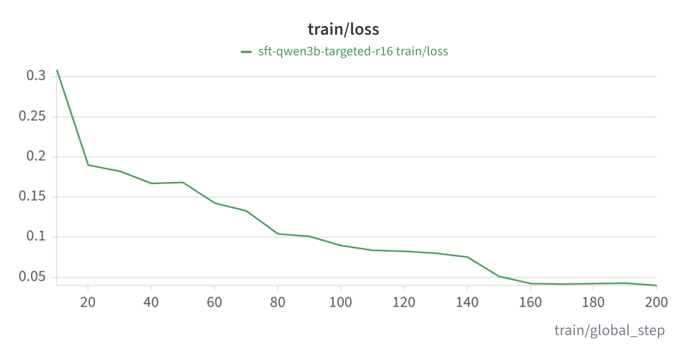
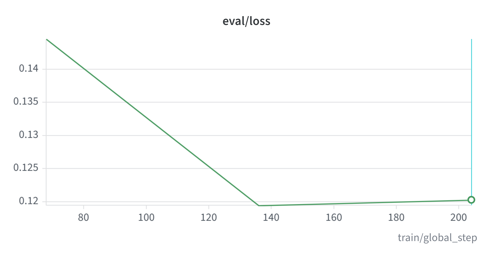
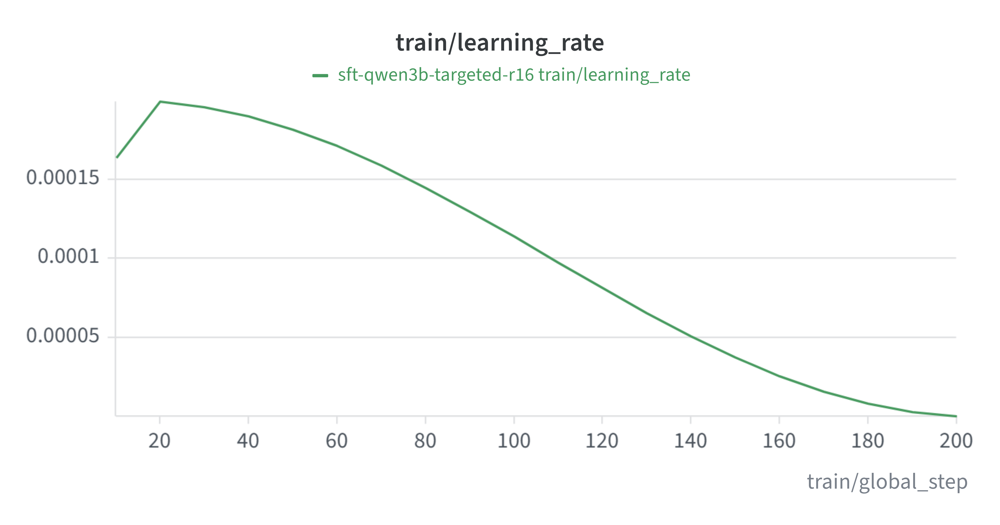
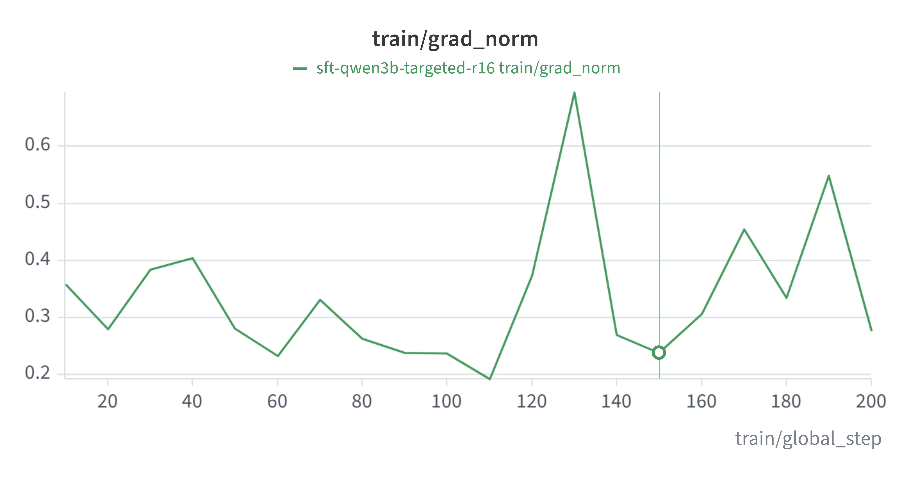
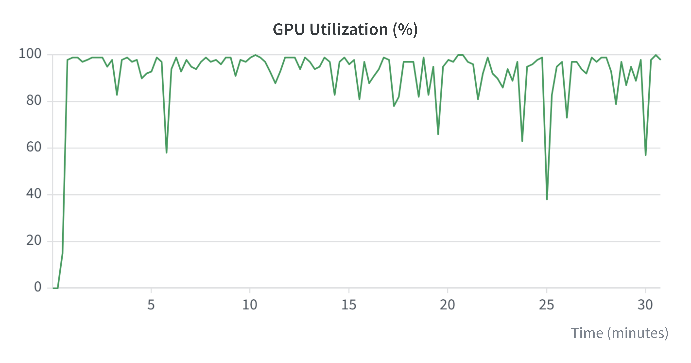
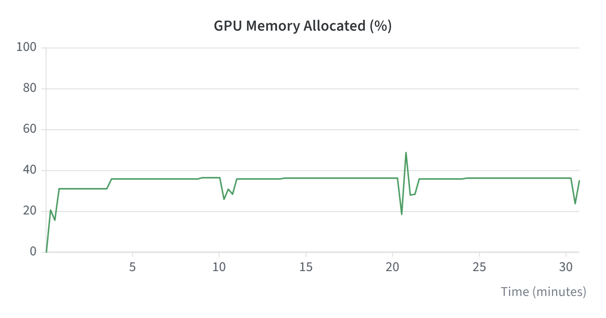

# M3 — Supervised Fine-Tuning (Qwen2.5-Coder-3B + QLoRA)

## 1. Setup

| Component | Value |
|---|---|
| Base model | `Qwen/Qwen2.5-Coder-3B-Instruct` (chosen in M2 — see `analysis/m2_comparison/summary_table.md`) |
| Quantisation | 4-bit QLoRA (`load_in_4bit: true`) |
| LoRA | r=16, α=32, dropout 0, bias none, all linear projections (`q,k,v,o,gate,up,down_proj`) |
| Max sequence length | 2048 tokens |
| Training framework | Unsloth `FastLanguageModel` + TRL `SFTTrainer`, `train_on_responses_only` (loss on the SQL completion only) |
| Hardware | Lightning AI T4 (16 GB), ~$0.19/hr |
| Tracking | W&B project `text2sql-post-training`, run `sft-qwen3b-r16` (tags `m3`, `sft`) |
| Config | `configs/sft.yaml` |

## 2. Training data

Built by `scripts/curate_sft_dataset.py` from **Spider train** only, weighted by the baseline error taxonomy
(`analysis/errors_3b_base_labeled.md`):

| Pool | Baseline errors | Weight | Quota (n=1100) |
|---|:---:|:---:|:---:|
| `p0_single_table` (no `JOIN` in gold) | 21 | 55.6% | 611 |
| `p1_negation` (`NOT IN` / `NOT EXISTS` / `EXCEPT`) | 5 | 13.2% | 146 |
| `p2_multi_hop` (≥2 joins) | 4 | 10.6% | 116 |
| `p3_agg_groupby` (`GROUP BY` / `HAVING`) | 4 | 10.6% | 116 |
| `other` (reserve) | — | 10.0% | 111 |

**Split:** `n_train=1000`, `n_eval=100` (seeded shuffle, `random.Random(42)`).

## 3. Training run

| Hyperparameter | Value |
|---|---|
| Epochs | 3 |
| Per-device batch size | 2 |
| Gradient accumulation | 8 (effective batch = 16) |
| Optimiser | `adamw_8bit` |
| Learning rate | 2e-4, cosine schedule |
| Warmup | 5% of steps |
| Weight decay | 0.01 |
| Precision | bf16 (auto-detected) |
| Steps | ~62/epoch × 3 ≈ **186 total steps** |
| Checkpoint selection | best `eval_loss` (`load_best_model_at_end=True`, `eval_strategy="epoch"`) |
| Seed | 42 |

Training curves (W&B exports):

| Train loss | Eval loss |
|---|---|
|  |  |

| Learning rate | Grad norm |
|---|---|
|  |  |

| GPU utilization | GPU memory allocated |
|---|---|
|  |  |

Adapter published to the Hugging Face Hub: `PhuocNg9604/qwen2.5-coder-3b-text2sql-sft`
(via `scripts/push_to_hub.py`); the local `checkpoints/sft` folder is empty.

---

## 4. Results

### 4.1 Prediction change matrix (n=100, same examples)

|  | SFT correct | SFT wrong |
|---|:---:|:---:|
| **Base correct** | Still correct: **56** | Newly wrong: **3** |
| **Base wrong** | Newly correct: **22** | Still wrong: **19** |

### 4.2 SFT vs Baseline comparasion

**Deliverables:** LoRA adapter on HF Hub · frozen predictions + metrics · labeled failure sets (`analysis/errors_3b_sft_labeled.md`)

| Metric (Spider dev holdout, n=100) | Base `Qwen2.5-Coder-3B-Instruct` | **SFT (QLoRA r=16)** | Δ |
|---|---:|---:|---:|
| Execution accuracy (EX) | 0.5900 | **0.7800** | **+0.19** |
| Invalid SQL rate | 21% | **11%** | −10 pp |
| Failed samples | 41 | **22** | −19 |
| Avg latency | 3687 ms | **1527 ms** | −59% |
| Peak VRAM (inference) | 2.06 GB | 5.84 GB | +3.78 GB |

## 5. Artifacts

| Artifact | Path |
|---|---|
| SFT config | `configs/sft.yaml` |
| Trainer | `src/training/sft.py`, `scripts/run_sft.py` |
| Pre-flight checks | `scripts/sft_smoke_test.py` |
| Dataset curation | `scripts/curate_sft_dataset.py` → `data/sft_full.jsonl` |
| Frozen eval set | `data/dev_set.jsonl` |
| Predictions + metrics | `predictions/qwen2.5_coder_3b_sft/` |
| Baseline predictions (3B) | `predictions/qwen2.5_coder_3b_instruct/` |
| Labeled failure sets | `analysis/errors_3b_base_labeled.md`, `analysis/errors_3b_sft_labeled.md` |
| Training curves | `docs/assets/*.png` |
| Adapter | HF Hub `PhuocNg9604/qwen2.5-coder-3b-text2sql-sft` |